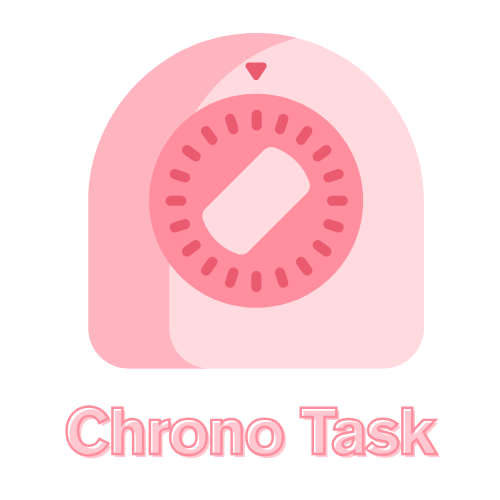
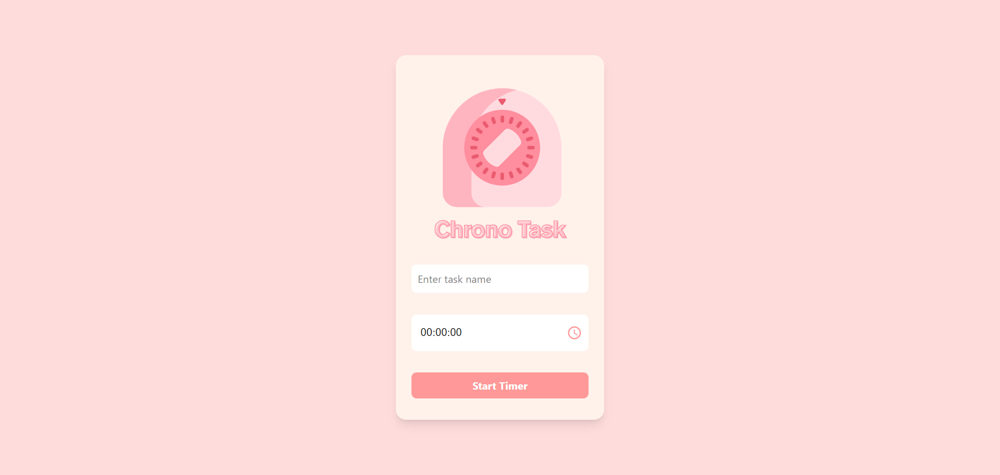
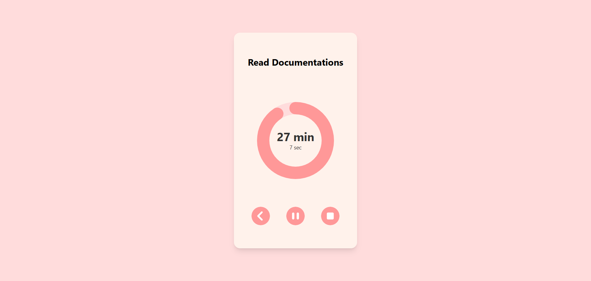

  

# ⏱️ Chrono-Task

**Chrono-Task** is a minimalist and efficient task timer web app. It helps users stay focused and productive by letting them set custom tasks and durations, with an alarm notification when time is up.

## 🚀 Features

- ✍️ **Write Task Name**: Input and label your current task
- ⏳ **Set Custom Duration**: Define how long the task should take
- 🔔 **Alarm Notification**: Get alerted with an alarm when your time is up

## 🛠️ Built With

- React JS
- Tailwind CSS
- Material UI

## 🌐 Live Demo

[Try Chrono-Task](https://chrono-task-two.vercel.app/)

## 📸 Preview

### Home Screen

### Task Timer

